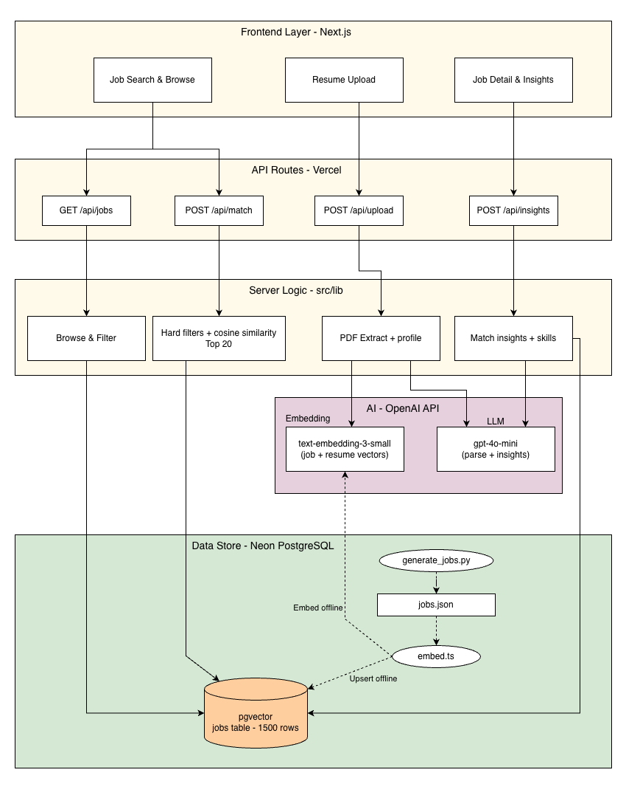
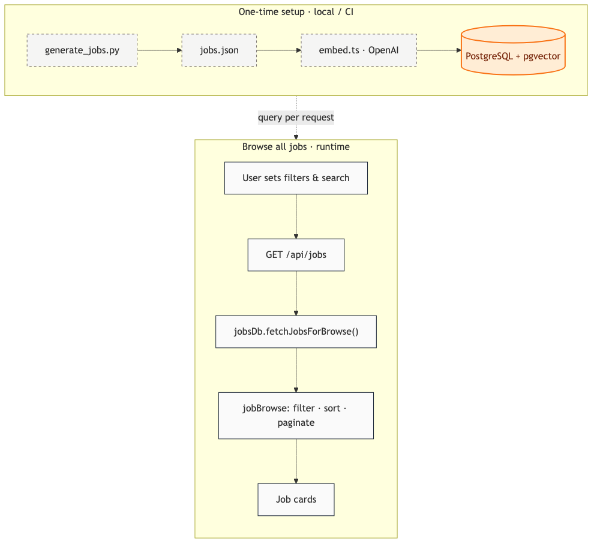
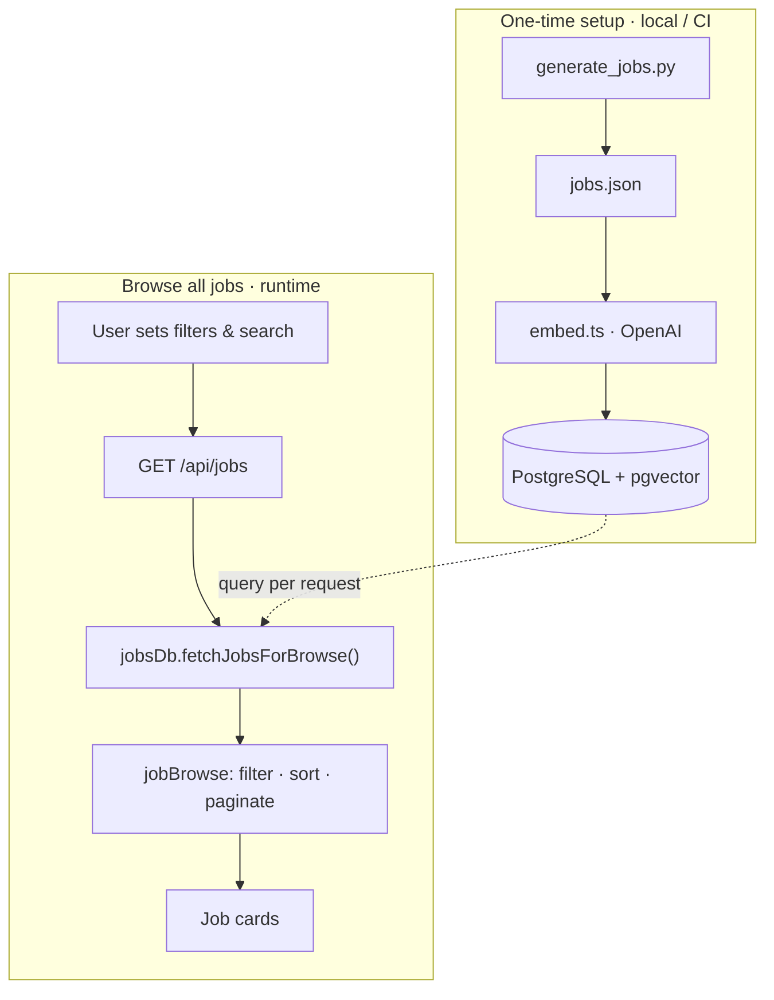
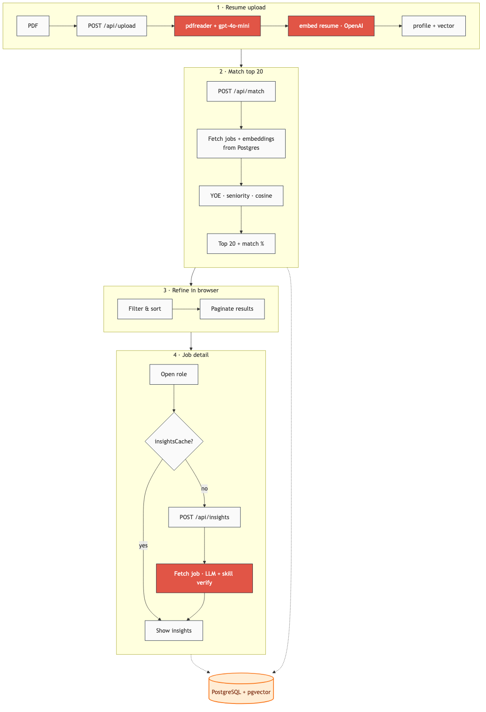
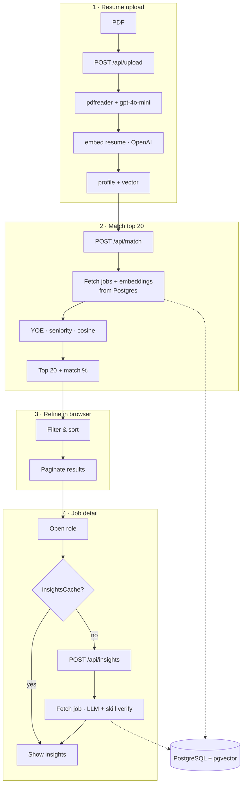
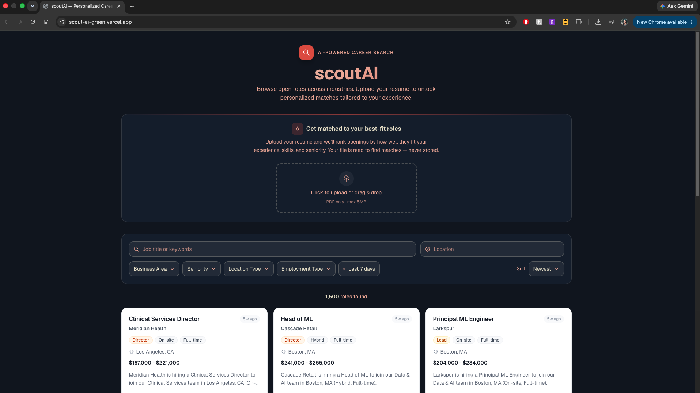

# scoutAI

scoutAI is an AI-powered career search platform that lets users browse ~1,500 synthetic job postings, filter and search them, and upload a PDF resume to unlock personalized top-20 matches with match scores, skill-keyword highlights, and LLM-generated fit insights.

Built as a full-stack **Next.js** app deployed on **Vercel**, with **OpenAI** for embeddings and LLM features, and **Neon PostgreSQL + pgvector** for job storage and vector search.

---

## Tech Stack

| Layer              | Choice                                                                               |
| ------------------ | ------------------------------------------------------------------------------------ |
| **Frontend**       | Next.js 16 (App Router), React 19, Tailwind CSS 4                                    |
| **Backend**        | Next.js API routes (`src/app/api/`)                                                  |
| **Hosting**        | Vercel (serverless)                                                                  |
| **Job data**       | PostgreSQL + **pgvector** (Neon-compatible); ~1,500 jobs with precomputed embeddings |
| **DB driver**      | `@neondatabase/serverless` (Vercel-friendly pooled Postgres)                         |
| **Embeddings**     | OpenAI `text-embedding-3-small` (1536-dim, shared space for jobs + resumes)          |
| **LLM**            | OpenAI `gpt-4o-mini` (resume parsing, match insights, skill keywords)                |
| **PDF parsing**    | `pdfreader`                                                                          |
| **Insights cache** | In-memory session cache (`src/lib/insightsCache.ts`)                                 |

---

## Architecture

High-level components and how they connect (Frontend → API routes → server logic → OpenAI / Neon Postgres).



| Layer | Components |
| ----- | ---------- |
| **Frontend · Next.js** | Job Search & Browse, Resume Upload, Job Detail & Insights |
| **API Routes · Vercel** | `GET /api/jobs`, `POST /api/upload`, `POST /api/match`, `POST /api/insights` |
| **Server Logic · src/lib** | Browse & filter, PDF extract + profile, hard filters + cosine top 20, match insights + skills |
| **AI · OpenAI** | `text-embedding-3-small` (job + resume vectors), `gpt-4o-mini` (parse + insights) |
| **Data Store · Neon PostgreSQL** | `pgvector` jobs table (~1,500 rows); offline ingest via `generate_jobs.py` → `embed.ts` |

Editable source: [`docs/scoutAI-architecture.drawio`](docs/scoutAI-architecture.drawio) (open in [draw.io](https://app.diagrams.net/)).

---

## Data Flow

### Browse all jobs



<details>
<summary>Mermaid source</summary>



</details>

Source: [`docs/data-flow-browse.mmd`](docs/data-flow-browse.mmd)

### Resume upload & match



<details>
<summary>Mermaid source</summary>



</details>

Source: [`docs/data-flow-resume.mmd`](docs/data-flow-resume.mmd)

### API routes

| Endpoint             | File                            | Purpose                                   |
| -------------------- | ------------------------------- | ----------------------------------------- |
| `GET /api/jobs`      | `src/app/api/jobs/route.ts`     | Browse: filter, search, sort, paginate    |
| `POST /api/upload`   | `src/app/api/upload/route.ts`   | PDF → LLM profile + resume embedding      |
| `POST /api/match`    | `src/app/api/match/route.ts`    | Hard filters → cosine → top 20            |
| `POST /api/insights` | `src/app/api/insights/route.ts` | LLM insights + skill keywords for one job |

---

## User Interface

_Add screenshots to `docs/` and uncomment the lines below._

#### Landing page — browse jobs with search and filters

<!--  -->

#### Resume upload and AI matching

<!--  -->

#### Top 20 matches with match score and filters

<!--  -->

#### Job detail — skills, match %, AI insights

<!--  -->

---

## Matching Approach

scoutAI uses a **hybrid matcher**, not pure keyword search or pure LLM ranking.

1. **Hard filters** (`matchFilters.ts`): years of experience (±1 year buffer from JD text) and seniority (±1 level).
2. **Semantic rank**: cosine similarity between resume embedding and each surviving job embedding.
3. **Top 20**: fixed cap for focused results (`MAX_MATCH_RESULTS = 20`).
4. **Match %**: scores are normalized **within the top-20 batch** to a 62–95% display range (relative rank, not absolute probability).
5. **Post-match filters**: user filters/sorts apply **client-side only** within the top 20.

---

## LLM & Embeddings (not classic RAG)

| Feature             | Model                    | Approach                                                                |
| ------------------- | ------------------------ | ----------------------------------------------------------------------- |
| Resume parsing      | `gpt-4o-mini`            | Structured JSON extraction from PDF text                                |
| Job/resume matching | `text-embedding-3-small` | Vector similarity over pre-embedded jobs                                |
| Insights + keywords | `gpt-4o-mini`            | Full job description + profile in prompt; server verifies skill matches |

This is **not RAG** in the retrieval sense for insights — the LLM receives the job and profile directly. Matching uses **precomputed embeddings** stored in PostgreSQL (pgvector); at ~1.5K jobs the API still applies YOE/seniority filters in app code then cosine-scores the survivor pool.

---

## Why This Stack?

- **Next.js on Vercel**: single repo for UI + API, fast deploy, no ops for the demo.
- **OpenAI embeddings** (vs local MiniLM): Vercel serverless cannot run ONNX/native transformer runtimes reliably; OpenAI keeps jobs and resumes in one vector space with zero extra infra.
- **PostgreSQL + pgvector**: job catalog and vectors in one store; removes the large embedded JSON from the deployment bundle; HNSW index ready as the catalog grows.
- **Top 20 + client-side refine**: keeps match latency predictable and lets users narrow AI results without re-scoring the full catalog.

---

## Getting Started

```bash
cd scoutAI
npm install
```

Copy `.env.example` to `.env.local` and set:

- `OPENAI_API_KEY`
- `DATABASE_URL` — PostgreSQL with the **pgvector** extension ([Neon](https://neon.tech) works well on Vercel)

### Database setup

```bash
# Create tables + pgvector indexes
npm run db:migrate

# Option A — import existing local embeddings (fast)
npm run db:seed

# Option B — re-embed from jobs.json into the DB
npm run embed:jobs
```

`embed:jobs` reads `src/data/jobs.json`, calls OpenAI, and upserts into PostgreSQL. Re-run after editing the job corpus or changing embedding models.

### Development

```bash
npm run dev
```

Open [http://localhost:3000](http://localhost:3000).

---

## Future Scope

- **Live job API ingestion**: cron/workers to ingest external postings into the same Postgres schema.
- **Vector search at scale**: pgvector, Pinecone, or OpenSearch for millions of jobs (ANN instead of full cosine scan).
- **External apply links**: wire the **View job** CTA to employer ATS URLs.
- **Persistent insights cache**: Redis or DB for multi-instance serverless.
- **Resume dedup**: hash uploaded PDFs to skip re-parsing identical files.

---

## Notes

- Synthetic jobs generated via `generate_jobs.py` in the repo root.
- Embedding script: `scripts/embed.ts` → upserts into PostgreSQL. One-time import from legacy JSON: `npm run db:seed`.
- Insights cache is **lazy** — only jobs opened in the detail panel are cached; cleared on new resume upload or “Browse all jobs”.
- Assignment context: demo architecture targets ~1.5K jobs today; notes in `notes.md` outline pgvector/ANN for production scale.
